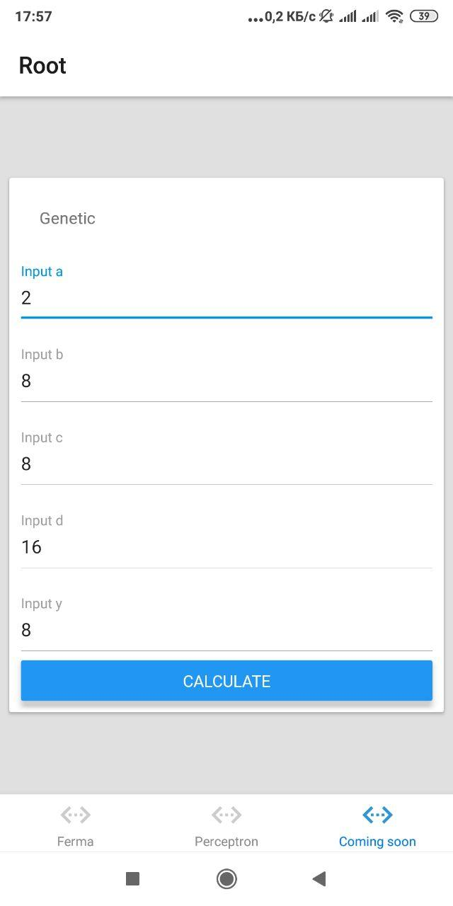
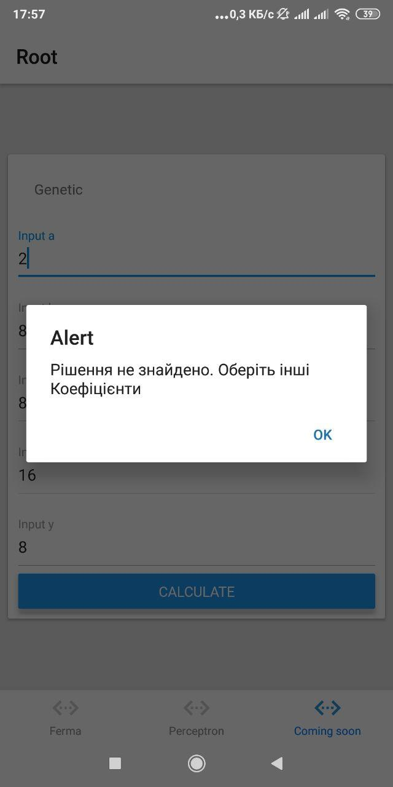
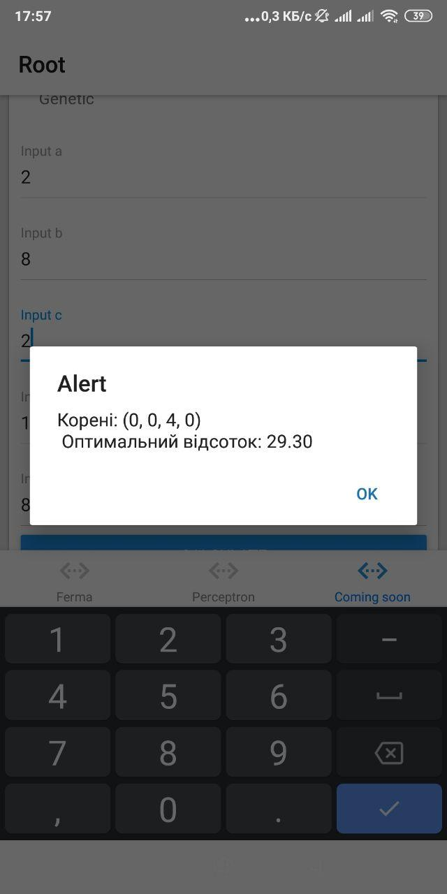

# RTS Lab3.1-3.3

## Usage

1. Clone the repo and move into the cloned directory
2. Install dependencies via `$ yarn` or `$ npm install`
3. Run the app via `$ yarn start` or `$ npm start`

## Examples

